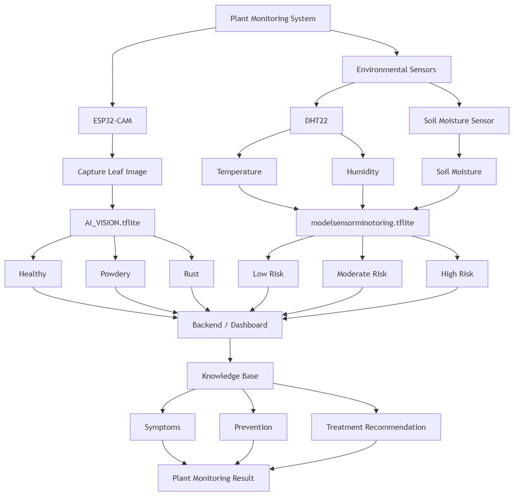
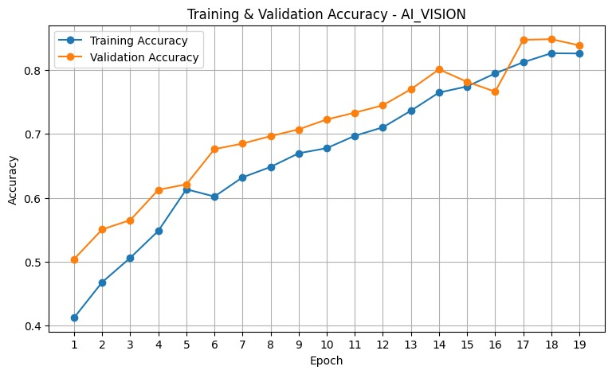
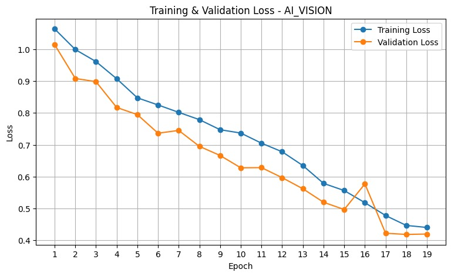
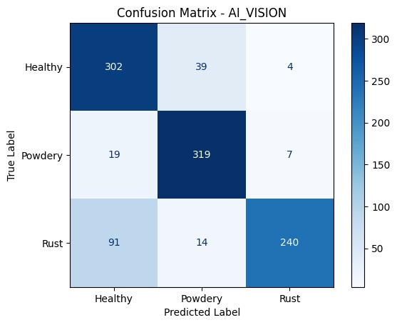
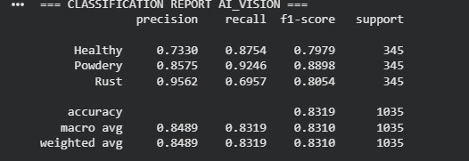

# AI Plant Monitoring System 🌱🤖

Sistem monitoring kondisi tanaman berbasis **AI Vision** dan **sensor lingkungan**. Proyek ini memadukan analisis citra daun dengan data temperatur, kelembapan udara, dan kelembapan tanah agar kondisi tanaman dapat dipantau melalui backend atau dashboard IoT.

## Gambaran sistem

Sistem dirancang dengan dua jalur analisis:

1. **AI Vision** — ESP32-CAM mengambil foto daun, kemudian `AI_VISION.tflite` mengklasifikasikan kondisi visualnya sebagai `Healthy`, `Powdery`, atau `Rust`.
2. **AI Sensor Monitoring** — DHT22 dan soil moisture sensor menyediakan data lingkungan untuk dianalisis menjadi tingkat risiko `Low`, `Moderate`, atau `High`.

Hasil kedua jalur diteruskan ke backend/dashboard. Knowledge base kemudian dapat menyediakan informasi gejala, pencegahan, dan rekomendasi penanganan.

> **Status model:** `models/AI_VISION.tflite` sudah tersedia. Model sensor `modelsensorminotoring.tflite` ditampilkan pada rancangan arsitektur, tetapi belum terdapat di repository ini.

## Diagram arsitektur dan alur kerja



Alur utamanya adalah:

```text
ESP32-CAM → Foto daun → AI_VISION.tflite ───────────────┐
                                                        ├→ Backend/Dashboard
DHT22 + Soil Moisture → Model sensor → Tingkat risiko ──┘
                                                             ↓
                    Hasil monitoring + knowledge base + rekomendasi
```

## Model AI Vision

| Item | Keterangan |
|---|---|
| Model deployment | `models/AI_VISION.tflite` |
| Model Keras awal | `models/AI_VISION.keras` |
| Sebelum external fine-tuning | `models/AI_VISION_before_external_finetune.keras` |
| Model Keras final | `models/AI_VISION_final.keras` |
| Kelas output | `Healthy`, `Powdery`, `Rust` |
| Total data evaluasi | 1.035 citra |
| Akurasi evaluasi | 83,19% |
| Macro precision | 84,89% |
| Macro recall | 83,19% |
| Macro F1-score | 83,10% |

Urutan label di atas mengikuti classification report yang tersedia. Saat mengimplementasikan inferensi, pastikan urutan label dan preprocessing citra sama dengan pipeline saat training.

## Hasil pelatihan dan evaluasi

### Akurasi training dan validation



Akurasi meningkat secara bertahap selama 19 epoch. Pada akhir pelatihan, training accuracy berada di sekitar 82–83% dan validation accuracy sekitar 84%.

### Loss training dan validation



Training loss dan validation loss sama-sama menurun. Pola ini menunjukkan proses pembelajaran berjalan stabil pada eksperimen yang didokumentasikan.

### Confusion matrix



| Label aktual | Healthy | Powdery | Rust |
|---|---:|---:|---:|
| Healthy | **302** | 39 | 4 |
| Powdery | 19 | **319** | 7 |
| Rust | 91 | 14 | **240** |

Model paling baik mengenali kelas `Powdery`. Kesalahan terbesar terjadi pada sampel `Rust` yang diprediksi sebagai `Healthy`, sehingga kelas tersebut menjadi area utama untuk peningkatan dataset atau fine-tuning berikutnya.

### Classification report



| Kelas | Precision | Recall | F1-score | Support |
|---|---:|---:|---:|---:|
| Healthy | 0,7330 | 0,8754 | 0,7979 | 345 |
| Powdery | 0,8575 | 0,9246 | 0,8898 | 345 |
| Rust | 0,9562 | 0,6957 | 0,8054 | 345 |

## Struktur repository

```text
AI_VISION/
├── README.md
├── models/
│   ├── AI_VISION.tflite
│   ├── AI_VISION.keras
│   ├── AI_VISION_before_external_finetune.keras
│   └── AI_VISION_final.keras
├── docs/
│   └── images/
│       ├── system-architecture-flow.png
│       ├── training-validation-accuracy.jpg
│       ├── training-validation-loss.jpg
│       ├── confusion-matrix.jpg
│       └── classification-report.jpg
└── external_test/
```

## Rencana integrasi IoT

1. ESP32-CAM mengambil citra daun dan mengirimkannya ke perangkat atau service inferensi.
2. Citra diproses menggunakan preprocessing yang sama dengan proses training.
3. `AI_VISION.tflite` menghasilkan probabilitas untuk tiga kelas kondisi daun.
4. DHT22 membaca temperatur dan kelembapan udara, sedangkan soil moisture sensor membaca kelembapan tanah.
5. Model sensor mengubah data lingkungan menjadi tingkat risiko.
6. Backend menggabungkan prediksi visual dan sensor.
7. Dashboard menampilkan kondisi tanaman, confidence score, data sensor, tingkat risiko, serta rekomendasi.

## Pengembangan berikutnya

- Tambahkan `modelsensorminotoring.tflite` dan dokumentasi input/output modelnya.
- Dokumentasikan ukuran input, normalisasi citra, dan versi TensorFlow Lite yang digunakan.
- Tambahkan file label agar pemetaan indeks output tidak ditulis langsung di aplikasi.
- Uji model menggunakan foto dari kamera dan kondisi pencahayaan yang berbeda.
- Tingkatkan recall kelas `Rust` dengan penambahan data dan augmentasi yang sesuai.
- Tambahkan contoh kode inferensi serta integrasi API/dashboard.

## Catatan

Project ini dibuat sebagai media pembelajaran dan eksperimen AI untuk monitoring tanaman. Prediksi model sebaiknya digunakan sebagai alat bantu pemantauan dan tetap diverifikasi dengan observasi langsung.
